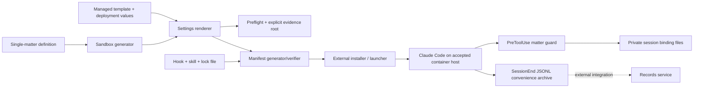

# Implemented architecture and deployment contract

This is a configuration and policy bundle with local command-line tooling. There is no application server, database, migration layer or background job. The target environment below is a deployment contract; it is not a shipped launcher or an observed certification.

## Components and flow

The generator validates a selected matter, narrow tooling paths and exact network hosts. It performs lexical POSIX validation even on Windows; only the target launcher can establish realpath, mount and network facts. The renderer combines that policy with managed controls and writes atomically. Preflight defaults to this repository's governance; an alternate evidence root must be explicit. Synthetic evidence does not approve real use.

The manifest records the supplied actual client version, version range and artifact hashes. It checks that the standalone sandbox matches the embedded policy. Signature verification and installation remain external responsibilities.

## Enforcement boundaries

1. **OS/container isolation:** primary filesystem/network boundary for interpreters. Only selected matter and approved tooling may be visible. Protect the managed bundle and its parent directories against replacement by the runtime UID; a read-only mount and nonroot process must be verified at the target.
2. **Managed settings and hook:** client controls and accidental cross-matter defense. PreToolUse has wildcard matcher; unknown tools default-deny. Bash is checked by cwd, not command parsing. LSP uses its filePath.
3. **Compliance skill:** model instructions for output and practitioner records. The external installer copies repository source `skills/ai-policy-compliance/SKILL.md` to `<managed-policy directory>/.claude/skills/ai-policy-compliance/SKILL.md`. Static tests check its text; installed-source discovery and invocation require a real client session, and neither establishes general behavioral or legal compliance.

Auth is supplied by Claude Code and the deploying organisation, not repository code. forceLoginOrgUUID is a placeholder until rendering; the example UUID is not authentication. Local hook state has filesystem permissions, not tenant accounts or a database. OS/account separation must protect it from other users.

## Supported deployment designs, acceptance pending

| Platform | Internal engineering tests | Confidential-matter boundary |
|---|---|---|
| Linux container / Docker / podman | Supported | Target design; host acceptance required |
| WSL2 with the same Linux container path | Supported | Target design; host acceptance required |
| macOS with Claude sandbox alone | Hook tests supported | Open question; not certified |
| Native Windows | Hook tests and static tooling supported | Unsupported; production preflight refuses |

No platform is certified by repository tests. The exact tested Linux installation has [delegated synthetic-scope host acceptance](policy-decisions/internal-mvp-owner-acceptance.md); the production operational register remains unresolved. Sandbox enabled without per-matter policy is insufficient. The checked-in template intentionally lacks that policy and uses warn/fail-open observation defaults.

## External launcher contract

This repository does **not** ship a launcher, container runtime, host firewall or records service. The deploying launcher must resolve an approved matter unambiguously, verify bundle hashes/signature, mount only the selected matter/tooling, install managed controls, set cwd and bind the session before tools run. It must refuse unknown/root/ancestor paths, missing sandbox, invalid bundle, visible siblings, missing hook and native Windows.

Complete [OS isolation acceptance](os-isolation-acceptance.md), including OS-level observation and a sabotaged-guard negative control. Assistant text alone cannot prove a file was never opened.

## State, records and failure paths

The hook uses exclusive session binding creation and validates persisted bindings on reuse; new processes retain the same identity. Invalid mode/configuration/input/state fails closed in enforce mode. Warn mode reports would-deny decisions; off disables the hook deliberately.

SessionEnd validates binding and archive destinations and writes without overwriting another session's transcript. Central archives use a full matter-identity hash, separating same-name matters. Errors are reported but do not provide durable operator alerting.

The hook emits no production records event. [records-schema.md](records-schema.md) describes the metadata an external service must create/validate. Encryption, retention, ingestion, integrity recording, access logs and legal hold are external. See [operations](operations.md) for safe recovery and legacy archive migration.

## Configuration and version boundaries

[Environment reference](environment.md) covers required/optional inputs. No .env file is loaded. Managed telemetry content gates are explicitly zero; validate collector observations after deployment. Local transcript cleanup and supplier retention are separate.

The version range is a declared policy limit; neither the minimum nor maximum is proof of complete compatibility. Acceptance records must name the actual client, settings sources and bundle commit. Re-run after client upgrades or tool-registry changes.

## Scope of the internal MVP

Offline synthetic verification is implemented. Live hook transport and model behavior require an authenticated CLI. Installed managed policy, container isolation, records ingestion and legal/supplier approval are separate acceptance tasks. See [readiness](INTERNAL_MVP_READINESS_REPORT.md), [remaining issues](INTERNAL_MVP_REMAINING_ISSUES.md) and [release checklist](release-checklist.md).

## Later synthetic engineering evidence

The 2026-09-08 [container checks](synthetic-container-checks.md) now include an external protected test launcher, a pinned Linux compatibility image, scoped AppArmor/seccomp policies, an authenticated organisation-bound managed session, restricted proxy egress and actual normal/sabotaged-guard OS observations. These are executable synthetic deployment evidence for the exact tested host and client, not a distributed repository runtime or confidential-data approval. Actual SessionEnd filing and encrypted restore similarly do not designate an accepted practice records service or recovery-key escrow.
